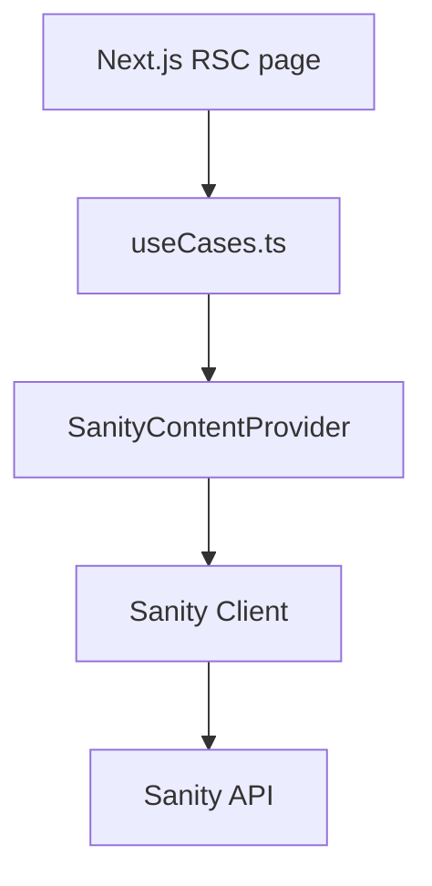

# Sanity CMS Adapter Design

## Goals
- Implement a Sanity-backed ContentProvider while keeping UI/use cases CMS-agnostic.
- Reuse existing domain models [`Post`](src/features/blog/domain/Post.ts:1), [`AuthorSummary`](src/features/blog/domain/Author.ts:21), [`TagSummary`](src/features/blog/domain/Tag.ts:12).
- Enforce published-only filtering; return `null` for not-found.

## Environment variables (add to env schema and .env.example)
- `SANITY_PROJECT_ID` (required)
- `SANITY_DATASET` (required)
- `SANITY_API_VERSION` (required, e.g. `2024-10-01`)
- `SANITY_READ_TOKEN` (optional; required only for private/draft reads)

## Dependencies
- Add `@sanity/client` (and optionally `groq` helper) to dependencies.

## Folder layout
- `src/lib/cms/sanity/client.ts`: create configured Sanity client (singleton factory) with CDN enabled when no token; set `useCdn: true` for public, `false` when token.
- `src/lib/cms/sanity/queries.ts`: GROQ query strings and small helpers (e.g., `latestPosts`, `postBySlug`, `allTags`, `postsByTag`).
- `src/lib/cms/sanity/mappers.ts`: pure mappers from Sanity shapes to domain models; no I/O.
- `src/lib/cms/sanity/SanityContentProvider.ts`: class implementing [`ContentProvider`](src/features/blog/services/ContentProvider.ts:1) using client + queries + mappers.
- `src/lib/cms/provider.ts`: factory returning `SanityContentProvider` (can later branch by feature flag).

## Sanity client (`client.ts`)
- Export `createSanityClient(config?)` that defaults from env parser.
- Configure: `projectId`, `dataset`, `apiVersion`, `useCdn`, `token`, `perspective: token ? "published" : "published"` (drafts not needed), `withCredentials: false`.
- Node runtime only; keep out of client components.

## GROQ queries (`queries.ts`)
- Base post projection should include: `_id`, `slug.current`, `title`, `excerpt`, `body`, `mainImage.asset->url`, `publishedAt`, `_createdAt`, `_updatedAt`, `status`, `author->{_id, name, slug, image.asset->url}`, `tags[]->{_id, name, slug}`.
- `latestPosts(limit)`: filter `status == "published" && defined(slug.current)`, order `publishedAt desc`, slice `0...limit` with defensive default (e.g., 20).
- `postBySlug(slug)`: same filter + `slug.current == $slug`, return first.
- `allTags`: distinct tags with slug defined, order by `name asc`.
- `postsByTag(tagSlug)`: posts where `$tagSlug in tags[].slug.current`, published only, ordered by `publishedAt desc`.

## Mappers (`mappers.ts`)
- Map Sanity post to domain `Post`: normalize IDs as `_id`, slug as `slug.current`, content as portable text rendered or raw string (choose raw string/markdown field name used in schema), coverImageUrl from `mainImage.asset.url`, author and tags mapped to summaries, status mapped to domain enum, dates as ISO strings.
- Provide summary helper to produce `PostSummary` shape (subset + tags/author/status).
- Keep null/undefined defensive defaults; drop drafts by caller (provider).

## Provider (`SanityContentProvider.ts`)
- Class `SanityContentProvider` depends on a Sanity client instance and uses queries/mappers.
- Methods implement `ContentProvider` contract:
  - `getLatestPosts(limit?: number)`: clamp to >0, default 20.
  - `getPostBySlug(slug: string)`: return `null` on not-found; sanitize slug via existing slug utility before query.
  - `getAllTags()`.
  - `getPostsByTag(tagSlug: string)`: sanitize slug, published only.
- Error handling: let errors bubble (pages handle), but wrap optional logging hook.
- Ensure outputs are serializable domain objects (no Date, no Sanity client refs).

## Provider factory (`src/lib/cms/provider.ts`)
- Export `createContentProvider()` that instantiates `SanityContentProvider` with default client; later can accept config for multi-CMS.

## Testing strategy
- Mappers: unit tests using fixed Sanity JSON fixtures; cover field mapping, optional fields, missing cover image, tags/author presence.
- Provider: mock Sanity client `fetch` to return fixtures; assert method arguments (queries and params), published-only, limit clamping, null handling for missing slug.
- Gates: run `npm test`, `npm run lint`, `npm run build`.

## Security & ops
- Do not embed tokens in client bundles; use server-side only. Keep token optional and avoid drafts unless required.
- Validate env at startup via env module; fail fast if required vars missing.

## Data flow (mermaid)

